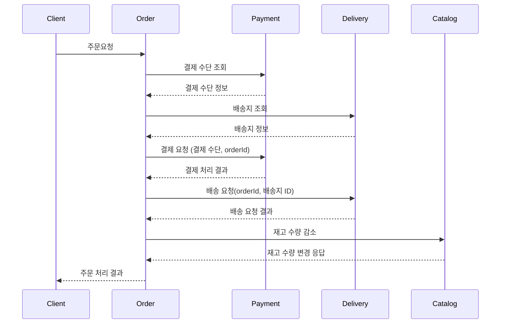

## 온라인으로 상품을 등록하고 판매하는 e-commerce 시스템으로, 다량의 데이터와 높은 동시접속자 수 환경에서 안정적으로 요청을 처리할 수 있다.

### 요구사항
1. 판매자는 상품을 등록할 수 있다.
2. 판매자는 상품의 설명, 수량 등 정보를 관리할  수 있다.
3. 구매자는 상품을 구매할 수 있다.
4. 구매자는 상품을 검색할 수 있다.
5. 구매자는 결제수단을 등록하고 주문시 사용할 수 있다.
6. 구매자는 배송지를 등록하고 주문시 사용할 수 있다.
7. 구매자는 완료된 주문의 상태를 조회할 수 있다.
8. 구매자는 완료된 주문의 배송 상태를 조회할 수 있다.
9. 구매자는 주문 내역 리스트를 볼 수 있다.
10. 구매자는 회원으로 등록할 수 있다.
11. 회원은 로그인을 할 수 있다.

---

### 서비스 분할

#### Product
- 역할: 상품 정보 관리
- 기능
1. 상품 등록
2. 상품 수정
3. 상품 수량 변경
4. 상품 조회
5. 상품 검색

#### Payment
- 역할: 결제 처리와 관련된 작업
- 기능
1. 결제 수단 등록
2. 결제 수단 변경
3. 결제
4. 결제 결과 조회

#### Order
- 역할: 주문 수행 및 상태 관리
- 기능
1. 상품 주문
2. 주문 상태 조회
3. 주문 내역 보기

#### Delivery
- 역할: 주문 완료된 제품 배송, 상태 관리
- 기능
1. 배송지 등록
2. 배송 처리
3. 배송 상태 조회

#### User
- 역할: 회원 관리 및 인증
- 기능
1. 회원 등록
2. 회원 정보 관리

---

### 기능 명세서

#### Product
- 역할: 상품 정보 관리
- 기능
1. 상품 등록: POST /products
2. 상품 수정: PUT /products/{productId}
3. 상품 수량 변경: PUT /products/{productId}/inventory
4. 상품 조회: GET /products/{productId}
5. 상품 검색: POST /products/search

#### Payment
- 역할: 결제 처리와 관련된 작업
- 기능
1. 결제 수단 등록: POST /payments/method
2. 결제 수단 변경: PUT /payments/method/{methodId}
3. 결제: POST /payments/process-payment
4. 결제 결과 조회: GET /payments/payments/{paymentId}

#### Order
- 역할: 주문 수행 및 상태 관리
- 기능
1. 상품 주문: POST /order/process-order
2. 주문 상태 조회: GET /order/orders/{orderId}
3. 주문 내역 보기: GET /order/orders

#### Delivery
- 역할: 주문 완료된 제품 배송, 상태 관리
- 기능
1. 배송지 등록: POST /delivery/addresses
2. 배송 처리: POST /delivery/process-delivery
3. 배송 상태 조회: GET /delivery/deliveries/{deliveryId}

#### User
- 역할: 회원 관리 및 인증
- 기능
1. 회원 등록: POST /member/registration
2. 회원 정보 관리: PUT /member/members/{userId}
3. 로그인: POST /member/login

---
### 시퀀스 다이어그램

---
### 아키텍처 고려사항
- 대용량 트래픽 처리: 동시에 많은 요청을 처리
- 탄력성: 급증하는 트래픽 처리
- 안정성: 트래픽 급증 또는 일부 장애 시 에러 최소화

#### 요구 성능

주요 목표: 100만명 동시 접속자 처리

- 동시 접속사 수 100만명
- 100만명이 10분에 하나씩 구매
- 분당 10건 구매 처리
- 초당 1666건의 구매 처리

> ***대용량 트래픽 처리***  
scale-out을 이용한 분산 처리, 일부 데이터 NoSQL

> ***탄력성***  
scale-out을 이용해서 대응, EDA를 사용해 보완

> ***안정성***  
EDA를 사용해 비동기 처리함으로써 장애 전파 최소화

